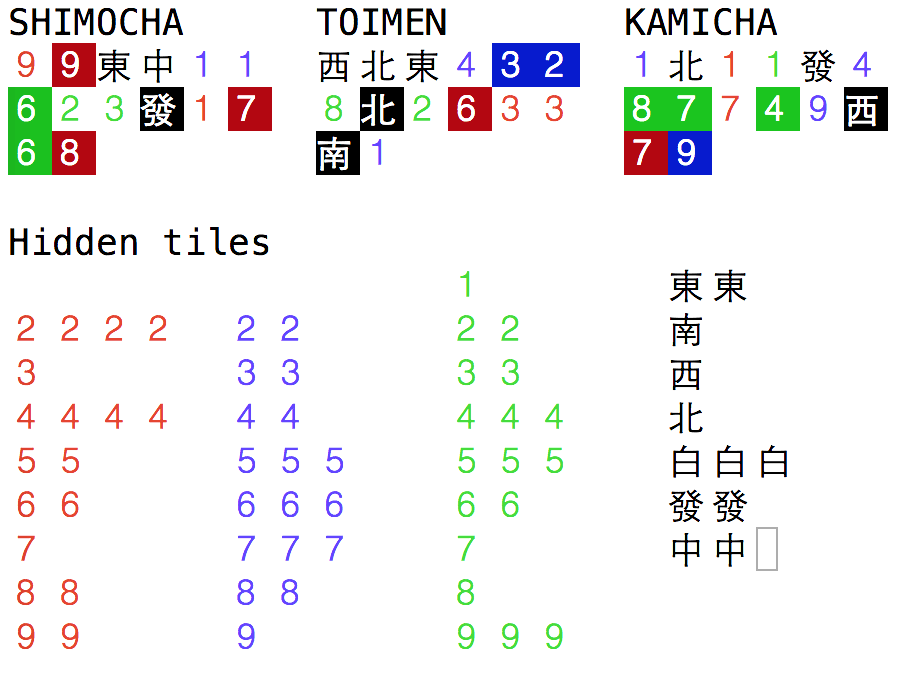

# Tenhud - HUD for tenhou.net

## Installation

```
npm install -g node-gyp
npm install -g tenhud
```

You’ll need to have Node on your machine. We recommend to use Node >= 6 and npm >= 3. You can use [nvm](https://github.com/creationix/nvm#usage) to get it and easily switch between versions.

You'll need libpcap installed. Most OSX machines seem to have it. All major Linux distributions have it available either by default or with a package like libpcap-dev. Refer to [pcap](https://github.com/mranney/node_pcap) if you have problems with installation.

I've tested it only with Flash web client on OS X so far.

## Motivation

Tsumogiri and tedashi are difficult to distinguish and analyze on tenhou web client. You have to practice in perceiving and remembering of tsumogiri before you will be able to see patterns in discards and make decisions based on it. So i decided to build helper software to jump over that gap.  

Another feature of this hud is a map of hidden tiles. It's useless for average player, but might help newcomers to play more consciously.

## Usage
Run:

```
tenhud
```

And start regular tenhou game.



Man tiles are red, pin - blue, sou - green. Tsumogiri is marked with colored background.

Hidden tiles are those lying in the wall or inside other player's hands.
